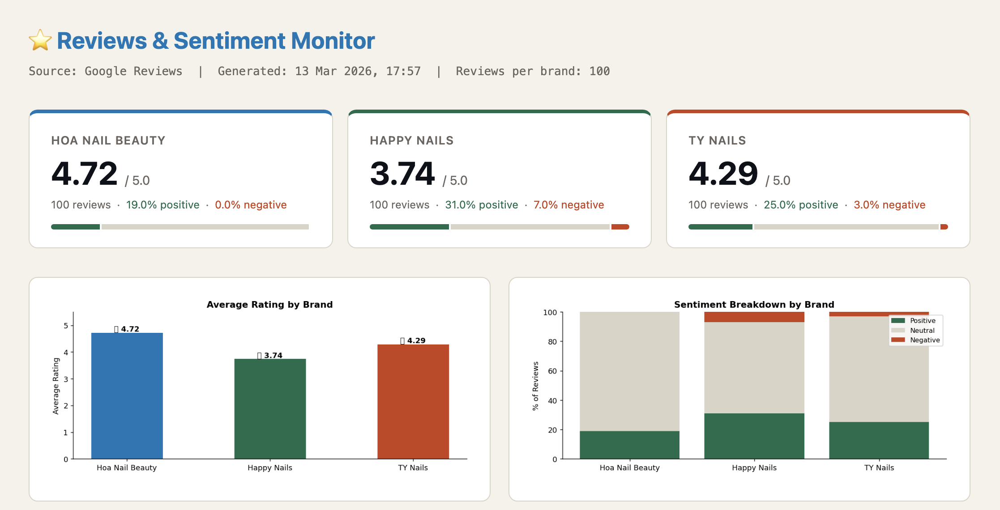
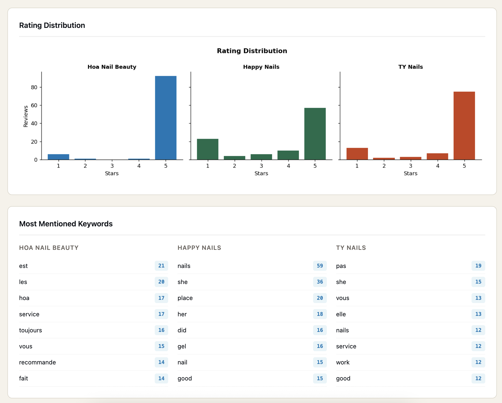
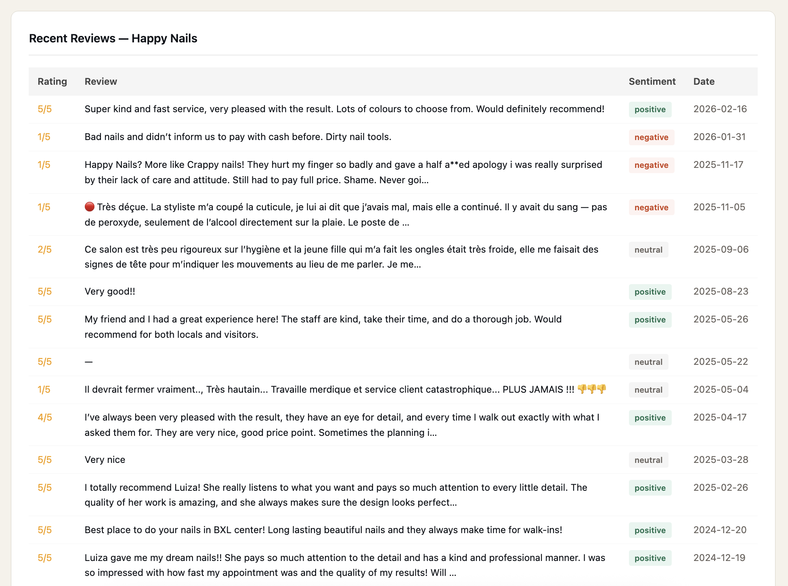

# Google Reviews & Sentiment Monitor

No more manually checking competitor reviews. This script pulls Google reviews for any brand and its competitors via Apify, runs sentiment analysis, and generates a clean HTML report — all in one run.

Output: a self-contained HTML dashboard with scorecards, charts, keyword breakdown, and a full review table per brand.

---

## Preview





---

## What you get

- Brand scorecards with avg rating + sentiment bar
- Side-by-side avg rating comparison chart
- Sentiment breakdown (positive / neutral / negative) per brand
- Rating distribution chart
- Top keywords extracted from reviews per brand
- Recent reviews table with sentiment labels
- Everything in one self-contained HTML file

---

## Stack

Python · Apify · Pandas · Matplotlib · Jinja2

---

## Setup

**Install dependencies**
```bash
pip3 install apify-client pandas jinja2 matplotlib
```

**Apify**
- Create a free account at [apify.com](https://apify.com)
- Go to Settings → Integrations → copy your API token
- Free plan gives $5 of credits/month — enough for thousands of reviews

**Configure**

Create a `config.py` file in the same folder:
```python
APIFY_TOKEN = "your_apify_token_here"
```

Then update the brands list in the CONFIG block:
```python
CONFIG = {
    "brands": [
        {"name": "Your Brand", "google_maps_url": "https://www.google.com/maps/place/..."},
        {"name": "Competitor A", "google_maps_url": "https://www.google.com/maps/place/..."},
    ],
    "reviews_per_brand": 100,
}
```

To get the right Google Maps URL — search for the business on Google Maps, click the listing, and copy the URL from your browser. It needs to contain `/maps/place/`.

**Run**
```bash
python3 reviews_monitor.py
```

Opens `reviews_report.html` in your project folder.
